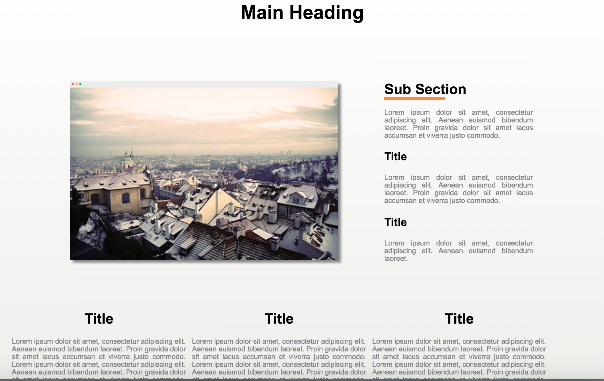

#Laying out an HTML SEO friendly page

- Using semantic HTML and CSS3 layout the below mock up
- You can find the mock up  [here](assets/task_image.png)
- You can find the main image [here](assets/main_picture.jpg)

**Note, this is as much as a review of HTML as it is a SEO task. You'll need to use most of what you've learnt so far.**

**You should ensure you use the following techniques:**

- The the main content should be in a wrapper `div` set to a width of 980px and alined to the centre 
- Add a white to grey gradient to the wrapper, work out how make the gradient resemble the mock up above 
- Add a drop shadow to the photo 
- You should use the following HTML5 tags `<section>` , `<aside>`, `<header>`

#SEO Optimisation 

We're now going to optimise this page to make it SEO friendly. 

- Firstly you need to find a a keyword to optimise the page for. Use the [key Word And competitor research](session9.6_key_word.md) techniques discussed in class to do this

- Now you have your keyword, perform some [on Page SEO](session9.4_onpage_seo.md) optimisation. 

- Finally, make sure your site has [Twitter and Facebook tags included](session9.7_social_media.md) 

**Advanced Task**

- In sub section create a styled data capture form 
- It should catch `name`, `email` and `phone_number`
- It will have a button, but for now won't actually submit anywhere

